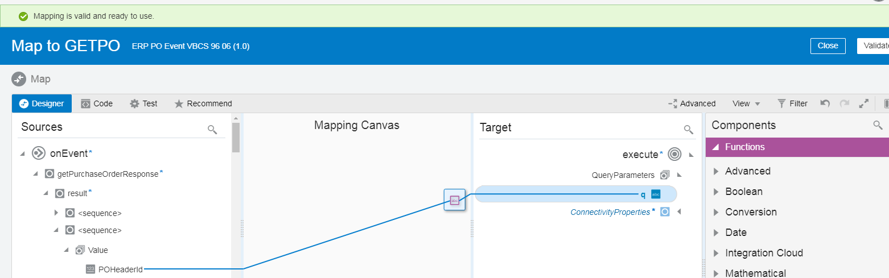
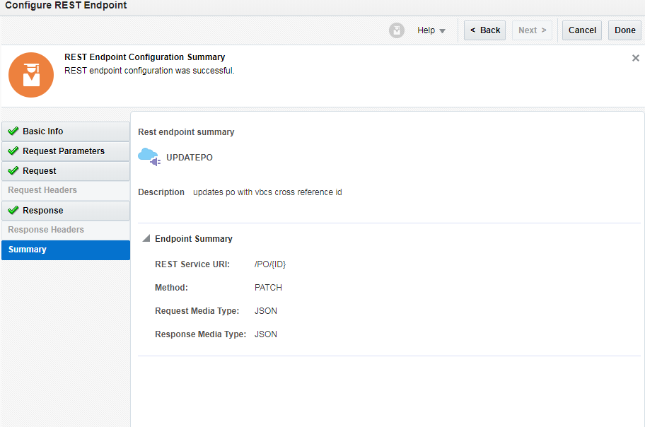
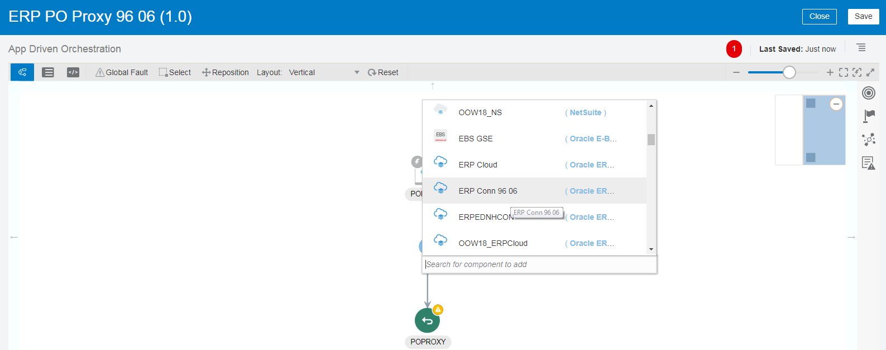
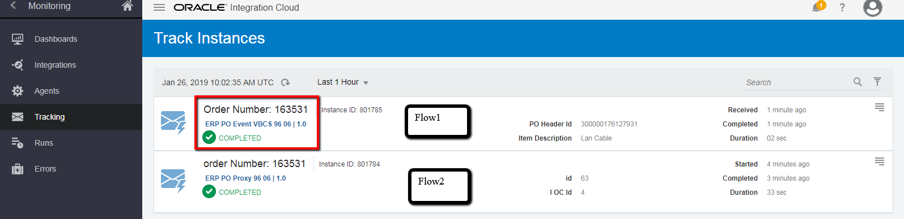

Contents
========

[EXECUTIVE SUMMARY 1](#executive-summary)

[USECASE BACKGROUND 1](#usecase-background)

[OBJECTIVE 2](#objective)

[BUILDING THE ERP CLOUD PO EVENT USE CASE
2](#building-the-erp-cloud-po-event-use-case)

[Prerequisites 2](#prerequisites)

[Import VBCS Web Application 3](#import-vbcs-web-application)

[Creating Connections (Flow1) 4](#creating-connections-flow1)

[Creating REST Connection 4](#creating-rest-connection)

[Creating the PO Event Integration (Flow1)
7](#creating-the-po-event-integration-flow1)

[Activate Integration (Flow1) 31](#activate-integration-flow1)

[Testing the ERP Event Flow Integration (Flow1)
32](#testing-the-erp-event-flow-integration-flow1)

[Creating Connections (Flow2) 38](#creating-connections-flow2)

[Creating the PO Proxy Integration (Flow2)
38](#creating-the-po-proxy-integration-flow2)

[Activate Integration (Flow2) 48](#activate-integration-flow2)

[Invoke ERP Cloud Service from VBCS Web App
49](#invoke-erp-cloud-service-from-vbcs-web-app)

[Running the VBCS Web App 56](#running-the-vbcs-web-app)

EXECUTIVE SUMMARY
=================

Oracle Integration provides native connectivity to Oracle and non-Oracle
Software as a Service (SaaS) and On-premises applications, such as
Oracle ERP Cloud, Oracle Service Cloud, HCM Cloud, Salesforce.com,
Workday, EBS, SAP, NetSuite and so on. Oracle Integration adapters
simplify connectivity by handling the underlying complexities of
connecting to applications using industry-wide best practices. You only
need to create a connection that provides minimal connectivity
information for each system.

USECASE BACKGROUND
==================

This use case explores the use of Oracle Integration to subscribe to
Oracle ERP Cloud Events and push the relevant event information to
downstream systems. As part of the lab you would be building the below
use case scenario.

1.  User creates a Purchase Order(PO) in ERP Cloud and a PO event is
    raised (Flow1)

2.  Oracle Integration subscribes to the PO event, transforms and pushes
    the relevant information to a custom table (VBCS) (Flow1)

3.  User attaches Letter of Credit (LOC) information to the PO record
    from the VBCS Web App. (Flow2)

4.  PO Record in ERP Cloud is updated with the LOC information in ERP
    cloud (Flow2)

The following diagram illustrates the proposed interaction between the
systems involved in this use case. There 2 flows to complete this use
case.

|                                                                   |
|-------------------------------------------------------------------|
|  |

OBJECTIVE
=========

This document walks you through the steps needed to replicate this use
case in your environment

BUILDING THE ERP CLOUD PO EVENT USE CASE
========================================

This section works through the steps that are required to build the
integration from scratch.

Prerequisites
-------------

You will need access to the following applications and artifacts:

-   Oracle Integration (OIC)

-   ERP Cloud R12+

-   VBCS App to import (LetterOfCreditPortal.zip)

Import VBCS Web Application
---------------------------

1.  Login to Oracle Integration homepage and Click on Visual Builder

2.  Select Import -\> Application from file and Upload the
    “LetterOfCreditPortal.zip” from the Lab artifacts

    Note: Since there are multiple attendees sharing a single
    environment, please use the

    \<ClassID\> \<StudentID\> information (will be provided to you by
    the instructor) as a suffix to your web application

    E.g. If your \<ClassID\> is 96 and your \<StudentID\> is 06, then
    you will name your web application as **LetterOfCreditPortal9606**

3.  Change the ApplicationId also to the same name
    (**LetterOfCreditPortal9606)** to avoid conflicts and Select
    **Import**

> 

1.  Confirm that your application is imported into VBCS. Open the
    Imported application and you would notice that a few pages and
    business objects relevant to the use case is pre created. We will
    use this web application in the later part of the lab.

> Select the imported Web Application and you will observe a few pages
> are pre created
>
> 

1.  Couple of Business Objects (PO and LOC) pre created

> 
>
> Click the PO Business Object, copy the Data endpoint as highlighted
> above, and save it for later use.

Creating Connections (Flow1)
----------------------------

The following Connections have been created and configured. You will be
using these connections for creating Integration flows

| Connection Name | Connection Type |
|-----------------|-----------------|
| ERP Conn 96 06  | ERP Adapter     |

### Creating REST Connection

1.  On the Oracle Integration home page, click Integrations

2.  Select the Designer-\>Connections tab

3.  Click on Create and search for REST Adapter by providing the search
    keyword “REST” and Select Create

    

4.  Provide following details and click on Create

<table>
<thead>
<tr class="header">
<th><strong>Field</strong></th>
<th><strong>Enter</strong></th>
</tr>
</thead>
<tbody>
<tr class="odd">
<td>Name</td>
<td><p>VBCS REST Con &lt;ClassId&gt;&lt;StudentId&gt;</p>
<p>Eg: VBCS REST Con 96 06</p></td>
</tr>
<tr class="even">
<td>Identifier</td>
<td><p>Nothing to enter. The value is automatically generated from the integration name: VBCS_REST_CON_&lt;ClassId&gt;_&lt;StudentId&gt;</p>
<p>Eg: VBCS_REST_CON_96_06</p></td>
</tr>
<tr class="odd">
<td>Role</td>
<td>Invoke</td>
</tr>
</tbody>
</table>


1.  Configure Connectivity and Security Property Values as per below
    table and Click “OK”

<table>
<thead>
<tr class="header">
<th><strong>Field</strong></th>
<th><strong>Enter</strong></th>
</tr>
</thead>
<tbody>
<tr class="odd">
<td>Configure Connectivity</td>
<td></td>
</tr>
<tr class="even">
<td>Connection type</td>
<td>REST API Base URL</td>
</tr>
<tr class="odd">
<td>Connection URL</td>
<td><p>Use the Data endpoint url copied from “Import VBCS App” Section” -&gt; Step 5</p>
<p>Provide the endpoint till “/data “</p>
<p>Ex: https://&lt;oichost&gt;/ic/builder/design/LetterOfCreditPortal9606/1.0/resources/data</p></td>
</tr>
<tr class="even">
<td>Configure Security</td>
<td></td>
</tr>
<tr class="odd">
<td>Security Policy</td>
<td>Basic Authentication</td>
</tr>
<tr class="even">
<td>Username</td>
<td>Use the same credentials as used for login into Oracle Integration console</td>
</tr>
<tr class="odd">
<td>Password</td>
<td>Use the same credentials as used for login into Oracle Integration console</td>
</tr>
</tbody>
</table>


Save and Test the connection


Creating the PO Event Integration (Flow1)
-----------------------------------------

1.  On the Oracle Integration home page, click **Integrations**.

2.  On the Integrations page, click **Create**. The Create Integration -
    Select a Style/Pattern dialog is displayed.

3.  Select **App Driven Orchestration** type of integration. The
    **Create New** Integration dialog is displayed.

4.  Enter the following information:

<table>
<thead>
<tr class="header">
<th>Field Element</th>
<th>Value</th>
</tr>
</thead>
<tbody>
<tr class="odd">
<td>What do you want to call your integration?</td>
<td><p>ERP PO Event VBCS &lt;ClassId&gt; &lt;StudentId&gt;</p>
<p>Ex: ERP PO Event VBCS 96 06</p></td>
</tr>
<tr class="even">
<td>Identifier</td>
<td>Accept the default identifier value. The identifier is the same as the integration name you provided, but in upper case.</td>
</tr>
<tr class="odd">
<td>Version</td>
<td>Accept the default version number of 01.00.0000. Alternatively, if you want to change the version number, enter the version using numbers only in this format: xx.xx.xxxx.</td>
</tr>
<tr class="even">
<td>What does this integration do?</td>
<td>This integration demonstrates the use of Oracle Integration ERP Cloud Adapter Eventing capability along with the REST adapter to store the PO record in VBCS PO Table</td>
</tr>
<tr class="odd">
<td>Which package does this integration belong to?</td>
<td><em>Leave blank</em></td>
</tr>
</tbody>
</table>


1.  Click **Create**. The integration canvas is displayed.


1.  Hover over the circle next to Start, and click on the + sign

2.  Select the ERP Connection (ERP conn 96 06) from the list which is
    pre created for you

3.  Enter details as in the screenshot below to define the endpoint in
    the flow


4.	In the next screen, select “Receive Business Events raised within ERP Cloud” as the option and search           for the “Purchase Order Event” and provide an XPath Expression as below and Click Next

    ```xml 
    <xpathExpr xmlns:ns0="http://xmlns.oracle.com/apps/prc/po/editDocument/purchaseOrderServiceV2/" xmlns:ns2="http://xmlns.oracle.com/apps/prc/po/editDocument/purchaseOrderServiceV2/types/"\>$eventPayload/ns2:result ns0:Value/ns0:PurchaseOrderLine/ns0:ItemDescription="Lan
    Cable"\</xpathExpr\>
    ```

Note: Change the highlighted value to some Item Description of your
choice to filter the PO Record that you would be creating in ERP Cloud
later. This is important as to filter your PO because multiple Users
would be creating PO Event flows.


1.  Select the Response type as “None” and Click Next

    

2.  Review summary page and Click Done

    

3.  Integration so far

> 

1.  Next we will add the Invoke Action Using the REST connection
    created earlier to verify if the PO exists in VBCS PO table. Hover
    on the wiring next to the “POEVENT” and click on “+” sign and Select
    the REST Connection (VBCS\_REST\_CON\_\<ClassId\>\_\<StudentId\>)

    

2.  In the “Basic Info” page provide the details as per the screenshot
    below and Click Next

    

3.  In the Request Parameters page Add a query parameter as per below
    and Click Next. We wanted to search for a PO which can be invoked
    using below query parameter format

    Ex:
    https://\<oid\_host\>/ic/builder/design/LetterOfCreditPortal/1.0/resources/data/PO?q=pOHeaderId=300000074157561

    

4.  In the Response page Select the Response payload format as JSON

    

    Select “inline” and enter the below JSON sample in the text area and
    Click OK. Select Next

    ```

    {
        "items": \[
    {
        "id": 24,
        "creationDate": "2019-01-13T23:12:09+00:00",
        "lastUpdateDate": "2019-01-13T23:12:09.027+00:00",
        "createdBy": "john.doe@example.com",
        "lastUpdatedBy": "john.doe@example.com",
        "pOHeaderId": "300000074157561",
        "orderNumber": "162180",
        "procurementBUId": "300000046987012",
        "procurementBusinessUnit": "US1 Business Unit",
        "supplierId": "300000047414679",
        "supplier": "Dell Inc.",
        "soldToLegalEntity": "US1 Legal Entity",
        "lOCId": null,
        "links": \[
    {
        "rel": "self",
        "href": "https://oic\_host/ic/builder/design/LetterOfCreditPortal/1.0/resources/data/PO/24",
        "name": "PO",
        "kind": "item",
        "properties": {"changeIndicator":
        "ACED0005737200136A6176612E7574696C2E41727261794C6973747881D21D99C7619D03000149000473697A65787000000001770400000001737200106A6176612E6C616E672E446F75626C6580B3C24A296BFB0402000144000576616C7565787200106A6176612E6C616E672E4E756D62657286AC951D0B94E08B02000078703FF000000000000078"}
        },
    {
        "rel": "canonical",
        "href":
        "https://oic\_host/ic/builder/design/LetterOfCreditPortal/1.0/resources/data/PO/24",
        "name": "PO",
        "kind": "item"
    }
    \]
    }
    \],
        "count": 1,
        "hasMore": false,
        "limit": 25,
        "offset": 0,
        "links": \[
    {
        "rel": "self",
        "href":
        "https://oic\_host/ic/builder/design/LetterOfCreditPortal/1.0/resources/data/PO",
        "name": "PO",
        "kind": "collection"
    }

    \]

    }

    ```

5.  In the Summary page review the information and click Done

    

6.  Integration so far…

    

7.  A Map Action (Map to GETPO) is created automatically. Perform the
    mapping as per below. Select the Map Action and Click on “Edit” to
    open the Mapper

Select the “q” Query Parameter from the Target, drag and drop the concat
function to build query parameter value as “pOHeaderId=300000074157561”.


Provide static value “pOHeaderId” as the first parameter value for the
concat(“”,””,””)

Provide static value “=” as the second parameter value for the
concat(“”,””,””)


Provide the third parameter value by dragging the “POHeaderId” element
inside the concat(“”,””,””)


Click on the Tick mark in the expression window to save your expression


Click on Validate to check for any errors.



Save your integration

1.  Now, we will assign PO Record Count value to a variable “POHeaderId”

    Hover on the wiring next to “GETPO” and click on “+” sign and Select
    Assign Action

    

    Provide a name for the Assign Action and Click on Create

    

    Click on “+” to add a new Variable. Add a variable “PORecordCount”
    of Data type string

    

    Click the pencil icon to “Add an expression” to assign record count
    value. In the expression builder drag and drop the count element
    that we got as a response from the GETPO API call from the earlier
    step.

    

    Validate and Close the Expression Builder…Save your integration

    Integration so far…

    

2.  Next we will try to build an if-else logic as per below pseudo code

Search for PO record based on POHeaderID (Implemented already in
previous steps)

If (count of PORecords in VBCS) = 1

\- Update existing VBCS PO Record

Else

\- Insert a new PO Record


Hover on the wiring next to the PORecord Acitivity and Select the
“Switch” Action


Below construct is created


**If – Flow (Condition 1)**

Select Condition “1” and click on Edit icon which brings up an
Expression builder and provide the condition as per below


1.  Hover on the wiring next to the If Condition (1) Action and Click
    on “+” Sign and select the “Assign” Action

    Provide a name for the Assign Action as “AssignVBCSPOId”

    Create a Variable “VBCSPOId” of String data type and add an
    expression as below. Validate and Close the expression builder.

    

    

    Validate and Close the Assign window. Save your integration.

2.  Hover on the wiring next to the Assign Action and Click on “+”
    Sign and select the REST Connection created earlier ex:
    VBCS\_REST\_CON\_\<ClassId\>\_\<StudentId\>

    

3.  In the Basic Info Page provide the details as per below and Click
    Next


1.  Nothing to Specify in Review Parameters page. Click Next

    

2.  In the Request Page Select the request payload format as “JSON
    Sample”. Select the “inline” link and provide the below Sample JSON
    request and Click Next

    

    ```
   
    {

        "orderNumber": "163521",
        "procurementBUId": "300000046987012",
        "procurementBusinessUnit": "US1 Business Unit",
        "supplierId": "300000047414679",
        "supplier": "Dell.",
        "soldToLegalEntity": "US1 Legal Entity",
        "lOCId": 2

    }

    ```

3.  In the Response page Select the request payload format as “JSON
    Sample”. Select the “inline” link and provide the below Sample JSON
    Response and Click Next

    ```
    
    {

        "id": 24,
        "creationDate": "2019-01-13T23:12:09+00:00",
        "lastUpdateDate": "2019-01-22T16:46:08+00:00",
        "createdBy": "john.doe@example.com",
        "lastUpdatedBy": "john.doe@example.com",
        "pOHeaderId": "300000074157561",
        "orderNumber": "163521",
        "procurementBUId": "300000046987012",
        "procurementBusinessUnit": "US1 Business Unit",
        "supplierId": "300000047414679",
        "supplier": "Dell.",
        "soldToLegalEntity": "300000046973970",
        "lOCId": null,
        "links": \[
    {

        "rel": "self",
        "href":
        "https://oic\_host/ic/builder/design/LetterOfCreditPortal/1.0/resources/data/PO/24",
        "name": "PO",
        "kind": "item",
        "properties": {
        "changeIndicator":
        "ACED0005737200136A6176612E7574696C2E41727261794C6973747881D21D99C7619D03000149000473697A65787000000001770400000001737200106A6176612E6C616E672E446F75626C6580B3C24A296BFB0402000144000576616C7565787200106A6176612E6C616E672E4E756D62657286AC951D0B94E08B0200007870400000000000000078"

    }

    },

    {

        "rel": "canonical",
        "href":
        "https://oic\_host/ic/builder/design/LetterOfCreditPortal/1.0/resources/data/PO/24",
        "name": "PO",
        "kind": "item"

    }

    \]

    }

    ```

4.  Review the Summary Page and Click on Done



1.  A Map Action (Map to UPDATEPO) is created. Select the Map Action
    and Click on Edit Icon and provide mapping as per below screenshots

<!-- -->

1.  Map $VBCSPOId **TO** TemplateParameters-\> ID

    

2.  Map onEvent -\>
    getPurchaseOrderResponse-\>result-\>\<sequence\>-\>Value-\>
    ProcurementBUId

    **TO** request-wrapper -\> procurementBUId

    

3.  4.  5.  Map onEvent -\>
    getPurchaseOrderResponse-\>result-\>\<sequence\>-\>Value-\>
    ProcurementBusinessUnit

    **TO** request-wrapper -\> procurementBusinessUnit

    

6.  Map onEvent -\>
    getPurchaseOrderResponse-\>result-\>\<sequence\>-\>Value-\> Supplier

    **TO** request-wrapper -\> supplier

    

7.  Map onEvent -\>
    getPurchaseOrderResponse-\>result-\>\<sequence\>-\>Value-\>
    SupplierId

    **TO** request-wrapper -\> supplierId

    

8.  Map onEvent -\>
    getPurchaseOrderResponse-\>result-\>\<sequence\>-\>Value-\>
    HeaderFlexfield-\>locId

    **TO** request-wrapper -\> lOCId

    

    Click on Save and Validate. Close the mapper

<!-- -->

1.  Integration flow so far…

    

2.  **Else – Flow**

    Hover on the wiring next to “Otherwise “ Action and Select
    VBCS\_REST\_CON\_\<ClassId\>\_\<StudentId\> connection

    

3.  In Basic Page configure the details as per below

    

4.  In the Request Page Select the request payload format as “JSON
    Sample”. Select the “inline” link and provide the below Sample JSON
    request and Click Next

```

{

"pOHeaderId": "300000074157551",
"orderNumber": "163521",
"procurementBUId": "300000046987012",
"procurementBusinessUnit": "US1 Business Unit",
"supplierId": "300000047414679",
"supplier": "Dell Inc.",
"soldToLegalEntity": "US1 Legal Entity"

}

```

1.  In the Response Page Select the response payload format as “JSON
    Sample”. Select the “inline” link and provide the below Sample JSON
    response and Click Next

```

{

    "id": 41,
    "creationDate": "2019-01-22T17:32:24+00:00",
    "lastUpdateDate": "2019-01-22T17:32:24.027+00:00",
    "createdBy": "john.doe@example.com",
    "lastUpdatedBy": "john.doe@example.com",
    "pOHeaderId": "300000074157551",
    "orderNumber": "163521",
    "procurementBUId": "300000046987012",
    "procurementBusinessUnit": "US1 Business Unit",
    "supplierId": "300000047414679",
    "supplier": "Dell Inc.",
    "soldToLegalEntity": "300000046973970",
    "lOCId": null,
    "links": \[

{

    "rel": "self",
    "href":
    "https://oichost/ic/builder/design/LetterOfCreditPortal/1.0/resources/data/PO/41",
    "name": "PO",
    "kind": "item",
    "properties": {
    "changeIndicator":
    "ACED0005737200136A6176612E7574696C2E41727261794C6973747881D21D99C7619D03000149000473697A65787000000001770400000001737200106A6176612E6C616E672E446F75626C6580B3C24A296BFB0402000144000576616C7565787200106A6176612E6C616E672E4E756D62657286AC951D0B94E08B02000078703FF000000000000078"

}

},

{

"rel": "canonical",
"href":
"https://oichost/ic/builder/design/LetterOfCreditPortal/1.0/resources/data/PO/41",
"name": "PO",
"kind": "item"

}

\]

}

```

1.  Review the Summary and Click Done

    

2.  A Map Action is created. Provide the mapping for the Map Action
    (Map to CREATEPO) as per the screenshot below

    

3.  Final Flow 1 Integration

    

    Save your integration flow.

4.  While you are in the Integration flow page, Select the Hamburger
    icon on the TOP right corner and click on Tracking. Configure
    OrderNumber, POHeaderId and ItemDescription as tracking identifiers
    to identify your instance quickly when we a PO is created in ERP
    Cloud. Click Save on the Tracking page.

    

Activate Integration (Flow1)
----------------------------

1.  On the Integrations page, click on the “*ERP PO EVENT VBCS
    \<ClassId\> \<StudentId\>”* flow using the slider button


1.  Check the *Oracle Recommends* check box to contribute your mappings
    to the Recommendations engine that then suggests mappings to you and
    other users for similar integrations. Also, check *Enable tracing*
    and *Enable payload* for debugging and troubleshooting (you would
    typically have the tracking and payload options disabled on
    production instances, but we enable them here for this lab).


1.  The activation should complete in a few seconds typically and show a
    green ribbon at the top.


Testing the ERP Event Flow Integration (Flow1)
----------------------------------------------

1.  Login into ERP Cloud as casey.brown with the credentials provided

2.  Select Procurement tab and click on Purchase Orders


1.  Select Tasks tab and Click on Create Order


1.  Enter Supplier information (Dell Inc.) and leave the rest to
    default. Click on Create


1.  In the Purchase Order page go to the Order Lines Section and provide
    Item information as below


Note: For “Description” enter a Unique Value of your choice, which was
provided in the xpath expression earlier when configuring the ERP
adapter PO Event

Ref: 

1.  Click on Submit to Create a Purchase Order. Make a note of the Order
    Number


1.  Click on Tasks tab and Select Manage Order


1.  Search for the Order Number and wait for the Status field to change
    to “Open”


1.  Go back to Oracle Integration -\> Monitoring -\> Tracking Page and
    Search for your instance with the Order Number as Tracking
    identifier


1.  Click on the instance and verify that the Flow is completed
    successfully


Since it is a new PO record which does not exist in VBCS “Otherwise”
flow path is chosen based on the condition

1.  Navigate to Visual Builder and Click on imported application

2.  Select the Business Objects Tab and click on “PO” object you should
    see a new record is created


Congratulations, you have now completed Flow1 of the Usecase


You leveraged rich capabilities of Oracle Integration such as ERP
Adapter Event Subscription Capabilities using and App-driven
(trigger-based) integration, ERP Cloud adapter, Rest adapter, Data
Mapper, Actions such as Invoke and Actvities such as Assign, Map,
If-Otherwise etc, Configuring Business Tracking Identifiers and
monitoring running flows.

You could now leverage this knowledge to design, activate and monitor
several use cases for ERP Real time Synchronization

Creating Connections (Flow2)
----------------------------

The following Connections have been created and configured. You will be
using these connections for creating Integration flow

| Connection Name             | Connection Type |
|-----------------------------|-----------------|
| PO REST Interface Con 96 06 | Rest Adapter    |
| ERP Conn 96 06              | ERP Adapter     |

Creating the PO Proxy Integration (Flow2)
-----------------------------------------

1.  On the Oracle Integration home page, click **Integrations**.

2.  On the Integrations page, click **Create**. The Create Integration -
    Select a Style/Pattern dialog is displayed.

3.  Select **App Driven Orchestration** type of integration. The
    **Create New** Integration dialog is displayed.

4.  Enter the following information:

<table>
<thead>
<tr class="header">
<th>Field Element</th>
<th>Value</th>
</tr>
</thead>
<tbody>
<tr class="odd">
<td>What do you want to call your integration?</td>
<td><p>ERP PO Proxy &lt;ClassId&gt; &lt;StudentId&gt;</p>
<p>Ex: ERP PO Proxy 96 06</p></td>
</tr>
<tr class="even">
<td>Identifier</td>
<td>Accept the default identifier value. The identifier is the same as the integration name you provided, but in upper case.</td>
</tr>
<tr class="odd">
<td>Version</td>
<td>Accept the default version number of 01.00.0000. Or, if you want to change the version number, enter the version using numbers only in this format: xx.xx.xxxx.</td>
</tr>
<tr class="even">
<td>What does this integration do?</td>
<td>This integration demonstrates the use of Oracle Integration REST adapter and ERP Cloud Adapter to create a REST to SOAP proxy for ERP Cloud webservices</td>
</tr>
<tr class="odd">
<td>Which package does this integration belong to?</td>
<td><em>Leave blank</em></td>
</tr>
</tbody>
</table>


Click **Create**. The integration canvas is displayed

1.  Hover over the circle next to Start, and click on the + sign

2.  Select the REST Connection (PO REST Interface Con 96 06) from the
    list which is pre created for you

3.  Enter details as in the screenshot below to define the endpoint in
    the flow


1.  In the Basic info page provide the endpoint name, uri, HTTP Verb and
    Select options for Request/Response payload. Click Next


1.  In the Request page Select Request payload format as “JSON Sample”
    and provide the sample JSON below by clicking on the inline link

```

{

    "id": 24,
    "lOCId": 3,
    "orderNumber": "163521",
    "pOHeaderId": "300000074157561",
    "procurementBUId": "300000046987012",
    "procurementBusinessUnit": "US1 Business Unit",
    "soldToLegalEntity": "US1 Legal Entity",
    "supplier": "Dell.",
    "supplierId": "300000047414679"

}

```

1.  In the Response page Select Response payload format as “JSON Sample”
    and provide the sample JSON below by clicking on the inline link

```

{

    "pOHeaderId":"300000074157561",
    "orderNumber":"162180",
    "soldToLegalEntityId":"300000074157561",
    "changeOrderNumber":3,
    "requestStatus":"SUCCESS"

}

```

1.  Review the Summary page and click on Done


A Request/Response Flow is created. Delete the “Map to POPROXY” Action


1.  Hover on the wiring next to POPROXY Action and Click on “+” sign
    and add the “ERP Conn 96 06” connection which is pre created



1.  In the Basic info page provide endpoint name , endpoint description
    and Click Next


1.  In the Actions Page, Select the Radio Button “Query, Create, Update
    or Delete Information” to consume Purchase Order V2 Service


1.  In the Operations Page Select Browse By -\> Services and Search for
    Purchase Order.

Select PurchaseOrderService and changePurchaseOrder operation to consume
in our flow.

Note: Select the correct PurchaseOrderService which has
“acknowledgePurchaseOrder” in the list of operations


Click Next

1.  Review the Summary Page and Click Done


1.  An invoke action is configured with changePO operation and an
    empty Map (Map to changePO) Action is created


1.  Edit the Map (Map to changePO) Action and provide below mapping


Select the element changeOrderEntry -\> ChangeOrderDescription which
opens up an expression window. Enter “Update of LOCId”


Expand “HeaderFlexField” element and map the following fields from
Source to Target

Map $Id -\> $cusotmerPO


Map lOCId -\> locId


Validate and Save your integration

1.  Hover on the wiring next to the changePO invoke activity and Click +
    sign to add a Map Action


1.  Edit the “Map to POProxy” Action and perform the mapping as per
    below

changePurchaseOrderResponse -\> result-\>POHeaderId **TO**
response-wrapper -\> poHeaderId

changePurchaseOrderResponse -\> result-\>OrderNumber **TO**
response-wrapper -\> orderNumber

changePurchaseOrderResponse -\> result-\>SoldtoLegalEntityId **TO**
response-wrapper -\> soldToLegalEntityId

changePurchaseOrderResponse -\> result-\>ChangeOrderNumber **TO**
response-wrapper -\> changeOrderNumber

changePurchaseOrderResponse -\> result-\>RequestStatus **TO**
response-wrapper -\> requestStatus


Click on Validate and Close

1.  Your Final integration flow…


1.  Click on Top right Corner and select Tracking. Add the below
    Business Identifiers for Tracking your instance


Click on Save.

Activate Integration (Flow2)
----------------------------

1.  On the Integrations page, click on the “*ERP PO Proxy \<ClassId\>
    \<StudentId\>”* flow using the slider button and Activate the
    Integration


1.  Click on How to run next to the Activation bar


Open the metadata url generated in a browser window.

This metadata url provides all the description about your REST Endpoint


1.  Copy the Swagger url from the Endpoint description. We will use the
    swagger definition in next section to create a service connection in
    VBCS Web application

Invoke ERP Cloud Service from VBCS Web App
------------------------------------------

1.  Select the Visual Builder tab, from the list of applications open
    the **LetterOfCreditPortal\<ClassId\>\<StudentId\> Web application**

2.  On the left hand side select Service Connections tab

> 

1.  Click on the “ + Service Connection” to create a new Service
    Connection to invoke on a button click

2.  In the “Create Service Connection” page select “Define by
    Specification”

> 

1.  Provide the highlighted information as per the screenshot and Click
    Next

> 

1.  In the Select Endpoints page Select the “PO\_PROXY” endpoint and
    click on Create

 

 Connection to the endpoint is created

 

1.  \(1) Click on Web application tab and (2) select the “editpopage” by
    expanding the localapp-\>flows-\>main.

    \(3) Select the “Change Order” button on the web page. (4) On the right
    handside select the Events tab

 

1.  Click on New Event and select “Quick Start: ojAction” to create a
    new Action Chain

 

1.  Provide Id as “ChangeOrderAction”. Drag and drop “Call REST
    Endpoint” action from Actions palette onto to the

    “+ Sign”


1.  Click on “Select Endpoint” and Configure the Service Connection
    created earlier.


Click on Select. The endpoint is now configured to be invoked from the
action chain.

1.  Select “Parameters” -\> body which opens a mapper interface page


1.  We want to Map the “editpopage” page variables to the endpoint
    interface.

> Map $poRecord(Sources) TO body (Target)


An expression is generated in the expression window based on the
mapping. poRecord is a page variable which holds the data from the
“editpopage”. Click on Save. You should see the body parameter now
marked as “MAPPED”

1.  From the Action palette Select “Fire Notification” action on to the
    “+” sign next to the “Call Rest Endpoint” activity


1.  Change the Notification type -\> info and provide a Message in the
    text area


Running the VBCS Web App
------------------------

1.  Click on Run


1.  The Web application opens up in a separate browser window. We have
    given a basic web app for you to test the end to end flow


1.  Click on LC List Page which displays all the Letter of Credits
    Available in a Custom table. Go back to the main page


1.  Click on PO List Page . All the PO records that was created earlier
    in ERP Cloud was synced into VBCS


1.  Select PO that you created and Click on “Edit PO”


1.  In the “Edit PO” page provide “LOCId” information. Leave the rest of
    the parameters intact

> 

1.  Click on “Change Order” button. Which invokes your “ERP PO Proxy
    \<ClassId\> \<StudentId\>” Integration flow

2.  You should see an instance is created. Go to Integrations -\>
    Monitoring -\> Tracking

    

3.  Select the Order Number and it confirm that the flow is completed
    and green


1.  Also, observe a notification created in the “Edit PO Page”.
    Confirming the payload is submitted to the Proxy Integration flow


1.  In the Integrations -\> Monitoring -\> Tracking page, you can
    observe another instance got created. As, LOCId is got updated in
    ERP Cloud Flow 1 is triggered again.

Note: Purchase Order Event is raised both for Create and Update records



Open the Instance and we see that “If” path is evaluated to Update the
PO into VBCS


1.  Now go back to the PO List page. It should now show the “LOCId”
    updated.


Congratulations, you have now completed Flow 2 and an end-to-end Flow to
capture PO Events and update with cross reference of Letter of Credit
Identifier from VBCS Web app.


